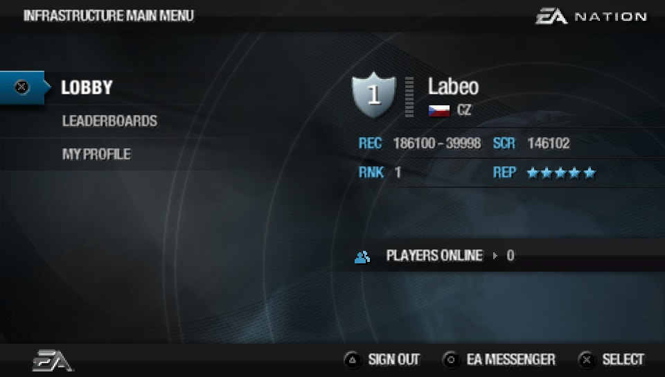
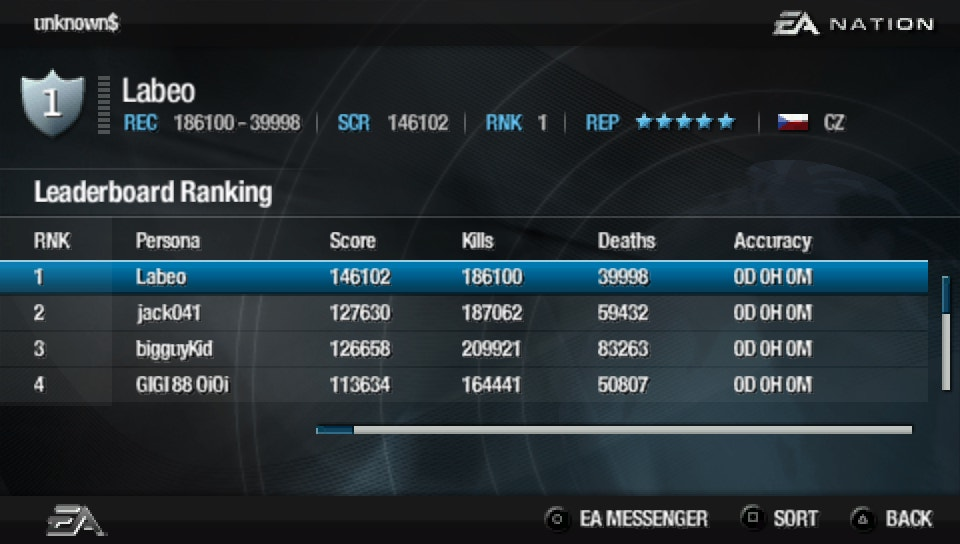
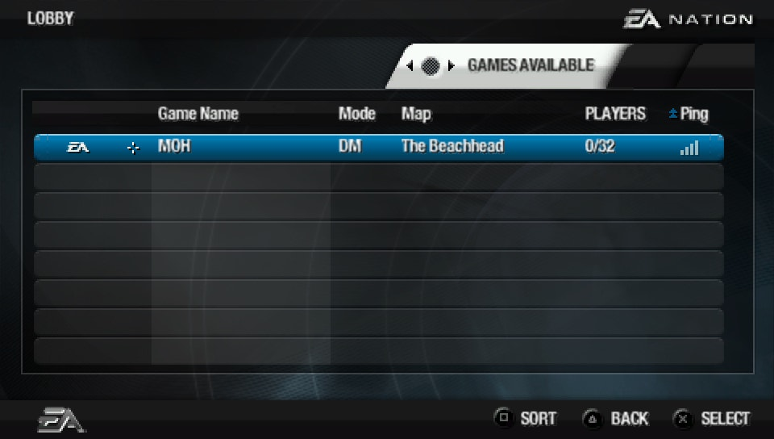
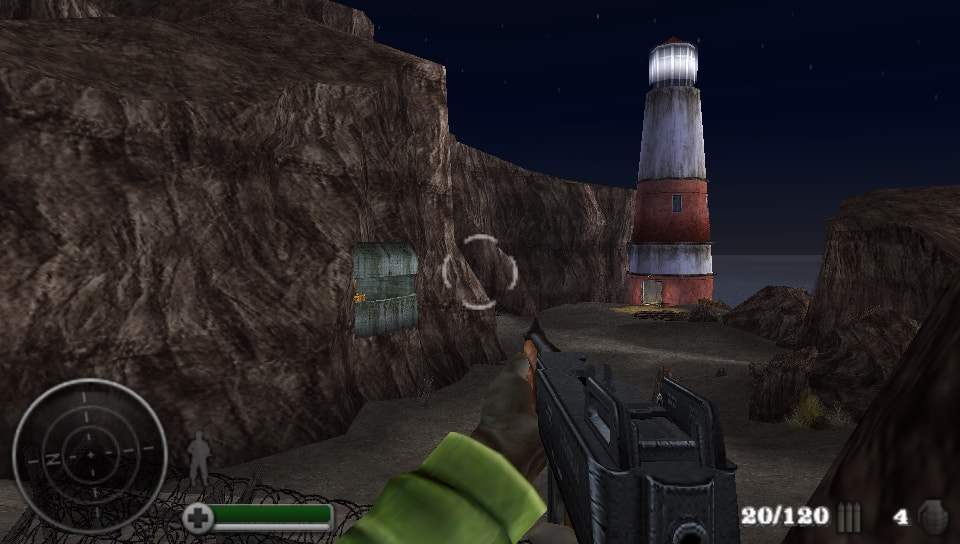
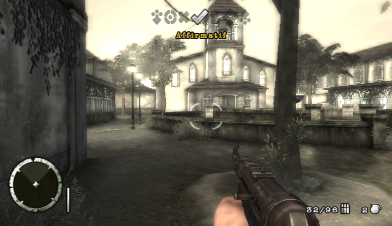

# Master Server for Medal Of Honor Heroes 1 & 2

This project aims to provide a master server for Medal of Honor Heroes 1 (PSP) and 2 (PSP/Wii).  
It uses the `User Hosted Server` formerly distributed by EA to host games for MoHH1.  
For MoHH2, a serverless patch has been made to allow playing alone on multiplayer maps. Playing with others isn't possible yet.

## Discord

[](https://discord.gg/fwrQHHxrQQ)

It is used to :
- Talk about the game
- Share technical knowledge
- Centralize documentation
- Regroup the community and organize events

Fell free to join !

## Wiki

Everything to know is in the [Wiki](https://github.com/a-blondel/mohh-master-server/wiki)  
It contains :
- Generic info about the games (weapons, maps,...)
- Technical knowledge (packet capture, ...)

## Development Status

You can follow the progress on the [project board](https://github.com/users/a-blondel/projects/2/views/1)

### Features
- [x] Access Nintendo WFC (Either with [nwc-server](https://github.com/a-blondel/nwc-server) or Wiimmfi) for the Wii version of MoHH2
- [ ] EA account management
  - [x] Create account
  - [x] Update account
  - [x] Use account
  - [x] Create persona
  - [x] Delete persona
  - [x] Use persona
  - [ ] Account recovery (require SMTP)
  - [ ] Password reset (require SMTP)
- [ ] Main menu
  - [x] Player info (Country, Kills, Deaths, Score, Rank, Reputation)
  - [ ] Online player count
- [ ] Lobby
  - [x] Games available
  - [x] Players in game
  - [ ] Filter options
  - [x] Create game
  - [x] Join game
- [x] Leaderboards
  - [x] My EA Leaderboard
  - [x] EA Top 100
  - [x] EA Weapon Leaders
- [ ] My profile
  - [ ] FAQ
  - [ ] Terms and conditions
- [ ] EA Messenger
  - [ ] List recently met people
  - [ ] List online/offline people and which game they play (friends/blocked/friend request)
  - [ ] Find Player
  - [ ] Send message
  - [ ] Send friend request
  - [ ] Block
  - [ ] Comment

Note that error messages eg 'invalid password'/'unknown account' are more or less complete.

MoHH screenshots :  

 <br/>
*Player details / Leaderboards*

 <br/>
*Lobbies / In Game*


MoHH2 screenshots :  

 <br/>
*Player details / Leaderboards*

 <br/>
*Lobbies / In Game (serverless patch)*

### Play online

- MoHH multiplayer is functional - Games can be hosted using the UHS (User Hosted Server)
- MoHH2 multiplayer isn't functional yet - Work is in progress. However, it's possible to play alone on MP maps thanks to a patch (see below).

## Requirements

### 1/ Riivolution patches (Wii only)

To make the game to use this server you need to activate a Riivolution patch (or a Gecko Code) when booting the game.  
They can be found here : https://github.com/a-blondel/mohh2-wii-patch

### 2/ Hosts file or DNS

In order to intercept requests from the game, you must either use a DNS server or edit your hosts file.

- Hosts file (for PPSSPP/Dolphin)

Add these lines to your hosts file (`C:\Windows\System32\drivers\etc`) :
```
127.0.0.1 pspmoh07.ea.com
127.0.0.1 wiimoh08.ea.com
127.0.0.1 pspmoh08.ea.com
127.0.0.1 tos.ea.com
127.0.0.1 naswii.nintendowifi.net
```

- DNS (for the Wii / PSP)

  - Host a DNS server (i.e. [Unbound](https://nlnetlabs.nl/projects/unbound/about/)) to redirect packets to the machine hosting the server.
  - Configure the console to use the DNS server

Unbound configuration (`service.conf`) :
```
server:
	# verbosity level 0-4 of logging
	verbosity: 1

	# On windows you may want to make all the paths relative to the
	# directory that has the executable in it (unbound.exe).  Use this.
	directory: "%EXECUTABLE%"

	# if you want to log to a file use
	logfile: "unbound.log"
	
	interface: ::1
	interface: 127.0.0.1
	interface: 192.168.1.1 # CHANGE IT !
	
	port: 53
	
	access-control: 127.0.0.0/24 allow
	access-control: 192.168.0.0/16 allow
	access-control: ::1 allow
	
	root-hints: "named.cache"
	
	local-zone: "pspmoh07.ea.com" static
	local-data: "pspmoh07.ea.com A 192.168.1.1" # CHANGE IT !
	
	local-zone: "wiimoh08.ea.com" static
	local-data: "wiimoh08.ea.com A 192.168.1.1" # CHANGE IT !
	
	local-zone: "pspmoh08.ea.com" static
    local-data: "pspmoh08.ea.com A 192.168.1.1" # CHANGE IT !
    
    local-zone: "tos.ea.com" static
    local-data: "tos.ea.com A 192.168.1.1" # CHANGE IT !
    
    local-zone: "naswii.nintendowifi.net" static
    local-data: "naswii.nintendowifi.net A 192.168.1.1" # CHANGE IT !
```

Change `192.168.1.1` to your server's IP address.


### 3/ JDK

This project has been initiated with the `JDK 17`, download it if needed.

### 4/ Maven

If you have downloaded Intellij, Maven comes bundled with, otherwise download the latest version of Maven.

### 5/ Define the host machine

Configuration is defined in `application.yml`.

For `tcp.host`, it depends on your use case :
- If you are running the server (not in WSL) and the game on the same machine (using PPSSPP/Dolphin), and you don't need to host for other machines, then no changes are needed.
- If you are running the server (in WSL) and the game on the same machine (using PPSSPP/Dolphin), and you don't need to host for other machines, then you must set the WSL's eth0 IP.
- If you are running the server for other machines (i.e. Wii/PSP, or another computer using PPSSPP/Dolphin), then you must set the machine IP (works for private and public networks).

## Run the server

### Development profile

By default, the server uses a Postgres database, but it is advised to use an in-memory H2 database for development, which is handy.

To do so, enable the `dev` profile when starting the server (VM Option `-Dspring.profiles.active=dev`).

The h2 console can be accessed in a browser when the server is running :
```
http://localhost:8080/h2/
```
(Information like database url, user and password can be found in `application.yml`)

### 1. Build the project

Run the following command :  
`mvn clean package`

### 2.a Start the server in Intellij

Create a new Application config in Intellij and set the following entry-point (main class) :
```
com.ea.ServerApp
```

Define the environment variables matching your need, mostly for the database (see `Database` chapter), e.g. :
```
DB_URL=jdbc:postgresql://localhost:5432/mohh_db;DB_USERNAME=user;DB_PASSWORD=password;LOGS=C:/moh/logs;TCP_HOST_IP=127.0.0.1
```

Replace with your own values.

### 2.b Start as a standalone jar

After a successful build, get into the target folder and execute one the following commands:
```
java -DDB_URL=jdbc:postgresql://localhost:5432/mohh_db -DDB_USERNAME=user -DDB_PASSWORD=password -DLOGS=C:/moh/logs -DTCP_HOST_IP=127.0.0.1 -jar mohh-master-server-*.jar
```

### 2.c Start with Docker

Open a terminal at the root of the project (where the Dockerfile is located). If you are using WSL :
```
cd /mnt/c/path/to/the/project
```

Create the image
```
docker build --tag mohh-master-server:latest .
```

You need to start a postgres container after creating a network :
```
docker network create mohh-network

docker run -d --restart=unless-stopped --network mohh-network \
  -e POSTGRES_USER=user \
  -e POSTGRES_PASSWORD=password \
  -e POSTGRES_DB=mohh_db \
  -p 5432:5432 \
  --name postgres \
  postgres:latest
```

Then, you can start the server using the network :
```
docker run --name mohh-master-server --rm -it \
  -p 21171:21171 -p 21172:21172 -p 21173:21173 \
  -e "LOGS=./logs" -e "TCP_HOST_IP=127.0.0.1" \
  -e "DB_URL=jdbc:postgresql://postgres:5432/mohh_db" \
  -e "DB_USERNAME=user" -e "DB_PASSWORD=password" \
  --network mohh-network \
  mohh-master-server:latest
```

If started in background, here is how to open a bash in the container :
```
docker container ls
docker exec -it <container-id> bash
```

Note that you can use a volume to persist the data of the postgres container and 
automatically restart the container when you boot WSL, see the `Database` chapter for more information.

## Database
To manage the database schema, **liquibase** is used.  

It is recommended to use a **postgres** database.  
You can install it on your machine or use a docker container.  

Data samples are provided in the `db/samples` folder for a quick start :
- `basic.sql` (lightweight, suitable for most cases)
- `full.sql` (mainly for leaderboards testing)

You can use a docker container to run an instance of postgres :
```
docker pull postgres:latest

docker run -d --rm \
  -e POSTGRES_USER=user \
  -e POSTGRES_PASSWORD=password \
  -e POSTGRES_DB=mohh_db \
  -p 5432:5432 \
  --name postgres \
  postgres:latest
```

To persist the data and automatically restart the container when you boot WSL, you can use :
```
docker pull postgres:latest

mkdir ~/postgres_data

docker run -d --restart=unless-stopped \
-e POSTGRES_USER=user \
-e POSTGRES_PASSWORD=password \
-e POSTGRES_DB=mohh_db \
-p 5432:5432 \
-v ~/postgres_data:/var/lib/postgresql/data \
--name postgres \
postgres:latest
```

Don't forget to set the environment variables (`DB_URL`, `DB_USER` and `DB_PASSWORD`) of the server !  
See "Run the server" chapter for a full example.
